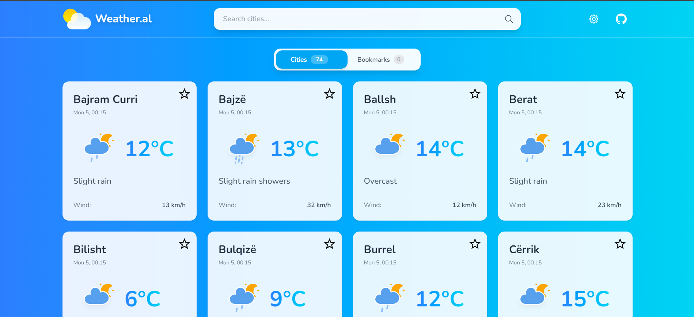
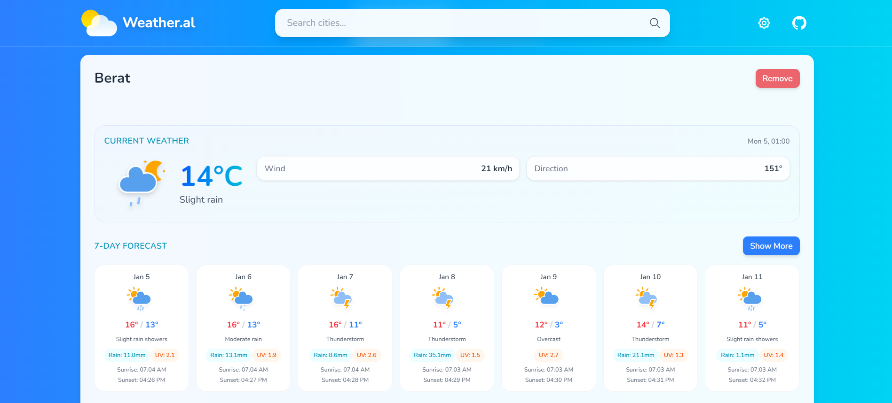

# Weather.al 🌤️

A modern, responsive weather application for Albanian cities built with React, TypeScript, and Vite. Get real-time weather information, forecasts, and bookmark your favorite cities.

## Screenshots

### Cities View



### Detailed Forecast & Bookmarks



## Features

### Weather Information

- **Real-time Weather Data** - Current weather conditions for all major Albanian cities
- **7-Day Forecast (Expandable to 16 Days)** - Detailed weather predictions with hourly breakdowns
- **Historical Data** - View past 7 days of weather data
- **Animated Weather Icons** - Beautiful animated SVG icons with day/night variations

### User Experience

- **Search Functionality** - Quickly find cities by name
- **Bookmarks System** - Save your favorite cities with persistent localStorage
- **Lazy Loading** - Efficient loading using Intersection Observer API
- **Responsive Design** - Optimized for mobile, tablet, and desktop devices
- **Toast Notifications** - User-friendly feedback for all actions

### Customization

- **Temperature Units** - Switch between Celsius and Fahrenheit
- **Weather Data Toggle** - Show/hide specific weather metrics:
  - UV Index
  - Sunrise/Sunset times
  - Humidity levels
  - "Feels like" temperature
  - Atmospheric pressure
- **Settings Persistence** - All preferences saved to localStorage

### Cities Coverage

Includes **74 Albanian cities** with accurate coordinates:

- Major cities: Tirana, Durrës, Vlorë, Shkodër, Korçë, Elbasan, Fier, Berat
- Regional centers and smaller municipalities
- Complete geographical coverage of Albania

## Getting Started

### Prerequisites

- Node.js (v16 or higher)
- npm or yarn package manager

### Installation

1. **Clone the repository**

   ```bash
   git clone https://github.com/klajdm/weather.al.git
   cd weather.al
   ```

2. **Install dependencies**

   ```bash
   npm install
   ```

3. **Start the development server**

   ```bash
   npm run dev
   ```

## Tech Stack

### Core

- **React 19.2** - UI library with latest features
- **TypeScript 5.9** - Type safety and enhanced developer experience
- **Vite 7.2** - Lightning-fast build tool and dev server

### Styling

- **Tailwind CSS 4.1** - Utility-first CSS framework
- **Radix UI** - Accessible component primitives
- **Lucide React** - Beautiful icon library
- **React Icons** - Additional icon sets

### Data & APIs

- **Open-Meteo API** - Free weather data (no API key required)
- **localStorage** - Persistent bookmarks and settings

### Development Tools

- **ESLint 9** - Code linting with modern flat config
- **Prettier 3.7** - Code formatting
- **TypeScript ESLint** - TypeScript-specific linting rules

## License

This project is licensed under the MIT License - see the [LICENSE](LICENSE) file for details.

## Contact

For questions or suggestions, please open an issue on GitHub.
